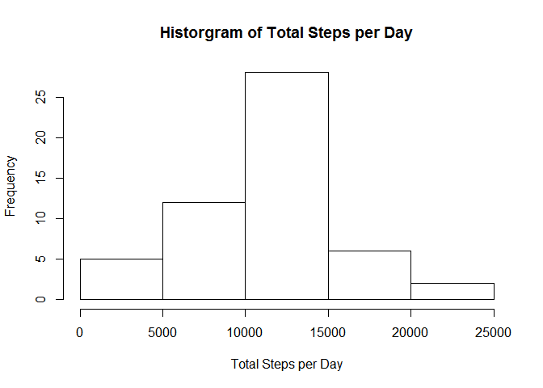
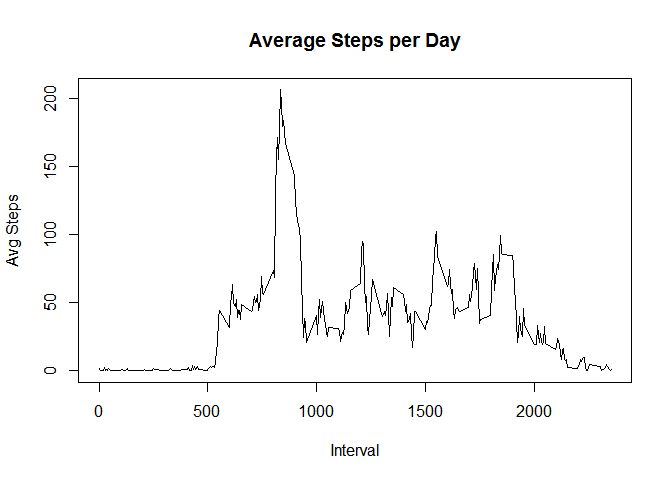
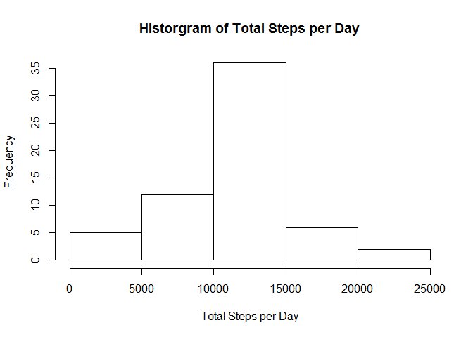
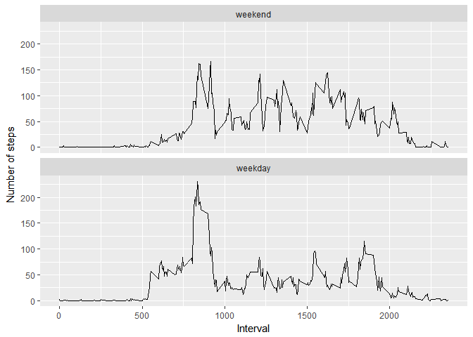

# Reproducible Research: Peer Assessment 1


## Loading and pre-processing the data


```r
temp <- tempfile()
download.file("https://d396qusza40orc.cloudfront.net/repdata%2Fdata%2Factivity.zip",temp)
data <- read.csv(unz(temp, "activity.csv"))
unlink(temp)
```
Here's a summary of the data set we're using:

```r
summary(data)
```

```
##      steps                date          interval     
##  Min.   :  0.00   2012-10-01:  288   Min.   :   0.0  
##  1st Qu.:  0.00   2012-10-02:  288   1st Qu.: 588.8  
##  Median :  0.00   2012-10-03:  288   Median :1177.5  
##  Mean   : 37.38   2012-10-04:  288   Mean   :1177.5  
##  3rd Qu.: 12.00   2012-10-05:  288   3rd Qu.:1766.2  
##  Max.   :806.00   2012-10-06:  288   Max.   :2355.0  
##  NA's   :2304     (Other)   :15840
```

## What is mean total number of steps taken per day?

Calculate the total steps per day and produce a histogram:

```r
sumByDay <- aggregate(steps ~ date, data, sum)
hist(sumByDay$steps,main="Historgram of Total Steps per Day",xlab="Total Steps per Day",ylab="Frequency")
```

<!-- -->

Calculate the mean of the total number of steps per day:

```r
mean(sumByDay$steps)
```

```
## [1] 10766.19
```

Calculate the median of the total number of steps per day:

```r
median(sumByDay$steps)
```

```
## [1] 10765
```

## What is the average daily activity pattern?

Calculate the avergae number of steps per interval over all days and plot time series:

```r
avgByInterval <- aggregate(steps ~ interval, data, mean)
with(avgByInterval,(plot(interval,steps,type="l",main="Average Steps per Day",xlab="Interval",ylab="Avg Steps")))
```

<!-- -->

```
## NULL
```

Identify the interval with the most avergae steps across all days:

```r
avgByInterval[which.max(avgByInterval$steps),]
```

```
##     interval    steps
## 104      835 206.1698
```

## Imputing missing values

Calculate the number of observations with missing values for steps

```r
sum(is.na(data$steps))
```

```
## [1] 2304
```

Create a new data set with missing values imputed using the mean for the interval across all days:

```r
noNaData <- data
for (i in 1:nrow(noNaData)) {
    if (is.na(noNaData[i,"steps"])) {
        noNaData[i,"steps"] <- avgByInterval[
            which(avgByInterval$interval==noNaData[i,"interval"]),"steps"]
    }
}
```

Calculate the total steps per day and produce histogram with new noNaData set:

```r
sumByDayNoNa <- aggregate(steps ~ date, noNaData, sum)
hist(sumByDayNoNa$steps,main="Historgram of Total Steps per Day",xlab="Total Steps per Day",ylab="Frequency")
```

<!-- -->

Calculate the mean of the total number of steps per day for the new noNaData set:

```r
mean(sumByDayNoNa$steps)
```

```
## [1] 10766.19
```

Calculate the median of the total number of steps per day for the new noNaData set:

```r
median(sumByDayNoNa$steps)
```

```
## [1] 10766.19
```

Using the average number of steps across all days for the missing steps values has had no effect on the mean for the total number of steps per day and slightly increased the median such that it is now the same as the mean.

## Are there differences in activity patterns between weekdays and weekends?

Add a weekday or weekend indicator:

```r
noNaData$dayType <- factor(weekdays(as.Date(noNaData$date)) %in% c("Saturday","Sunday"),levels=c(TRUE,FALSE),labels=c("weekend","weekday"))
```

Calculate the avergae steps per interval for each day type:

```r
avgByIntervalAndDayType <- aggregate(steps ~ interval + dayType, noNaData, mean)
```

Produce a two-panel time series chart showing the mean steps per interval for each day type:

```r
library(ggplot2)
```

```
## Warning: package 'ggplot2' was built under R version 3.3.3
```

```r
ggplot(avgByIntervalAndDayType,aes(x=interval)) + geom_line(aes(y=steps)) + facet_wrap(~dayType,ncol=1)+labs(x="Interval",y="Number of steps")
```

<!-- -->
